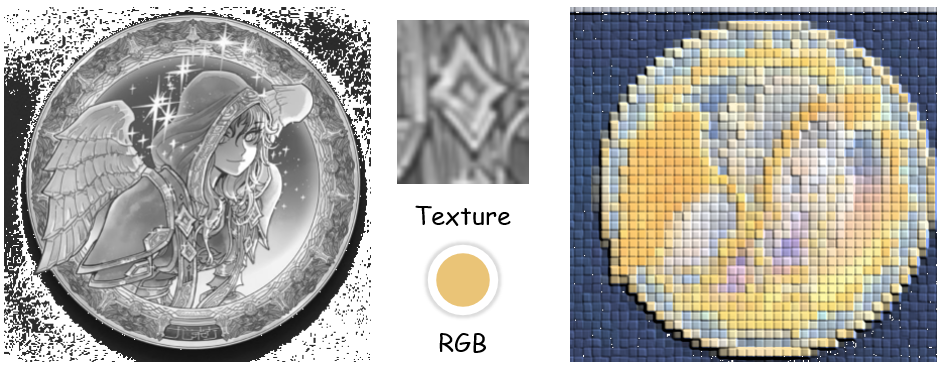

# Color texture

Use CNN to learn how to color a picture based on its textures.

## CNN model

What does the CNN learn?
It learns the relationship between texture and color

$$rgb = \psi(texture)$$

where, $rgb \in R^3$ refers the RGB color values, and the $texture \in R^{w \times h}$ refers the local texture features.


The structure of the CNN model is as following


The input is the small patch of local image texture.
The gray channel of a picture is considered as the texture.


Assume we have some pictures,
the aim is to teach the CNN to learn how to color the gray-scaled textures.


The relationship between texture and rgb is following



## How to use

The main.py is what you need for a quick startup.

```shell

# The example of train the CNN model using 1.jpg
# The model will be trained,
# the parameters will be saved,
# and the other pictures will be converted.

python main.py assets/1.jpg

```

## Contents

The project contains the folders:

- assets: The pictures being converted with each other;
- converted: The converted pictures;
- parameters: The trained parameters of the pictures in assets.

The project contains the scripts:

- images.py: The python script to load image into Image class;
- main.py: The main python script of training the model, it also convert the pictures;
- batch.sh: The shell script of running several main.py.

The parameters of the CNN:

- The parameters are specifically to the picture;
- After the model is trained, the parameters will be saved in the parameters folder.


